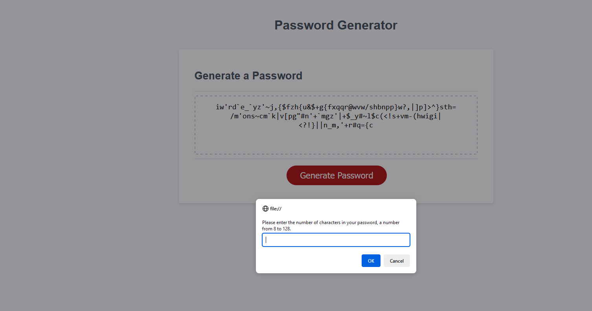

# Password Generator

## Description

The goal of this project was to create a randomly generated password based on a user's criteria. Using JavaScript, I created a series of prompts to ask the user their desired length and which characters they would like included. Based on those choices, the program then selects which arrays of characters to include in the password. Using Math.floor() and Math.random() inside a for loop, it selects a random character from the chosen arrays and adds it to the new password until it reaches the desired length.

## Installation

N/A

## Usage
[Click here to view the project on GitHub pages.](https://whimsically.github.io/password-generator/) Click the "Generate" button to receive a series of prompts asking the length of the password and which characters you would like to include.

## Credits

This was a project made for the KU full stack coding bootcamp. The CSS, HTML, and some JavaScript were provided by them. I've marked in the comments which lines of JavaScript were provided.

## License

Please see the license in the GitHub repo.